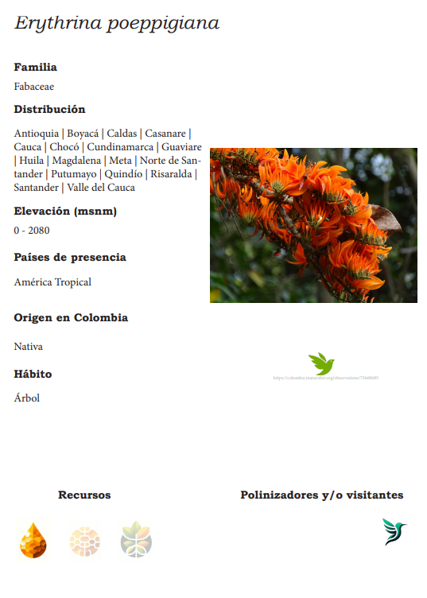

# Automated-Botanical-Catalog
This repository documents a project developed in collaboration with the University Botany Group, where we created a visual catalog of plant species that updates automatically from a connected database.

👉 We designed a system that:

📄 Uses Adobe InDesign as the layout platform

📊 Pulls structured information from an Excel-based dataset

🔄 Allows the content of each page (text, icons, images) to be updated with a single click

Automatically generates species cards like this one:

  

🧰 Tools used

    💻 InDesign	Layout design for the cards
    📈 Excel	Botanical data management
    🔁 Data Merge	Automated population of templates
    🧑‍🔬 Botany Group	Scientific content validation
    🎯 Outcomes
    ✅ Over 25 species cards generated automatically

✅ Easy to update or republish the catalog without manual formatting

✅ Works for both printed and digital outputs

📌 Why is it meaningful?
This project showcases the potential of combining editorial design with structured data to save time, reduce human error, and support science communication and education.

Do you want to build your own automatic plant catalog? 🌿